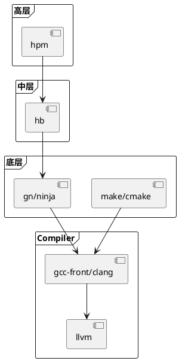
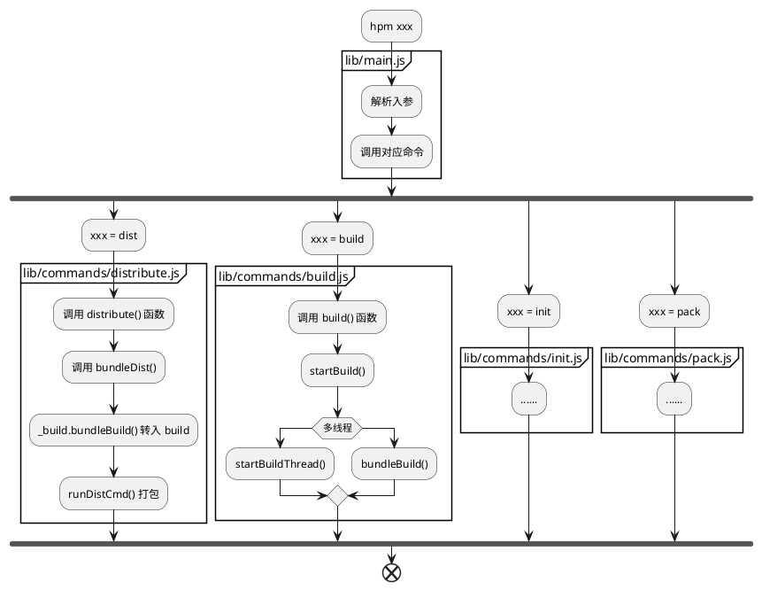
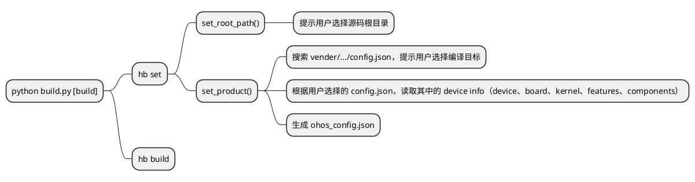

# OpenHarmony 组件的编译、构建

gcc
鸿蒙中可以使用多种工具进行编译，可以将其分为高、中、低三层：



几种工具的对比：

| Build Tool | 开发语言     | 开发方 | 资源                                                                                       |
| ---------- | ------------ | ------ | ------------------------------------------------------------------------------------------ |
| [hpm][]    | js           | HW     |                                                                                            |
| [hb][]     | python       | HW     | [gitee](https://openharmony.gitee.com/openharmony/build_lite)                              |
| [gn][]     | C++/Python   | o-lim  | [github](https://github.com/o-lim/generate-ninja)                                          |
| [ninja][]  | C++/Python/C | ninja  | [github](https://github.com/ninja-build/ninja)、[Doc](https://ninja-build.org/manual.html) |

[bpm]: https://www.npmjs.com/package/@ohos/hpm-cli
[hb]: https://pypi.org/project/ohos-build/
[gn]: https://gn.googlesource.com/gn
[ninja]: https://ninja-build.org/

我们先从底层说起。

## gn 和 ninja

说实话，理解 gn 和 ninja 对于没有接触过 make、cmake 的同学是有困难的，很难理解这些跨平台工具出现的真正意义及其要解决的问题。更不要说长期使用 VS、Eclipse、XCode 等成熟 IDE 的通信，这些过程都被 IDE 屏蔽掉了，但在 Linux 和嵌入式开发中它有是空气和水一般的存在，所以，嗯……随缘吧。

编译文件依赖树从 make 到 cmake 至 gn+ninja，编译前后端工具从 gcc 到 gcc+llmv 至 clang+llvm，这么多年来经历的变迁不是很多，至少相比各种编程语言的变迁少太多了。

ninja（忍者），google chromium 团队出品，致力于比 make 更快的编译系统，ninja 像是编译器（Compiler）的预处理器，主要目的是递归查找好依赖关系，提前建立依赖树，gcc 可按照依赖树依次编译，大大减少编译期间杂乱的编译顺序造成的查找和重复时间。ninja 首次在 2016 年的 Android N 中使用，当前被广泛应用在希望从编译耗时中解脱出来的大型项目中。

gn 意思是 generate ninja，即生成 Ninja 所需的文件（meta data），所以 gn 自称为元数据构建（meta-build）系统，也是 google chromium 团队出品，gn 的文件后缀为 `.gn`、`.gni`。

gn 类似 cmake，ninja 类似 make，cmake 最终也是生成 makefile，gn 则会生成 ninja 文件，都是为了减少手工写 make/ninja 文件的工作量。

如果使用 harmony 提供的 docker，gn 和 ninja 都已经安装好了：

```bash
root@90065f887932:/home/openharmony# gn --version
1717 (2f6bc197)
root@90065f887932:/home/openharmony# ninja --version
1.9.0
```

### gn

#### 命令

gn 的常用命令及简单流程：

- `gn gen`: 生成 ninja 能够使用的构建文件
  - 在指定目录查找 `.gn` 文件，它没有文件名，只有扩展名，如果不存在则向上找直到找到一个，并将其设为 root，Harmony 通常从 `build/lite/.gn` 开始。
  - 解析 root 下的 gn 文件以获取 buildconfig 文件名称，执行 buildconfig 文件（这是一个默认工具链）
  - 解析 root 下的 `BUILD.gn` 文件，加载其依赖的其它目录下的 `BUILD.gn` 文件
    - BUILD.gn 一般作为模块的工程入口文件，可以配合.gni 文件来划分源码或模块。
    - 当多个模块之间差异很小时，可以利用 BUILD.gn 来统一管理这些模块的设置，利用.gni 来专属负责各个模块源文件管理。
  - 编译出.ninja 文件保存到 `out/`下，如： `./out/arm/obj/ui/web_dialogs/web_dialogs.ninja`;
  - 当所有的目标都解决了， 编译出一个根 build.ninja 文件存放在 `out/` 根目录下。
  - Tips
    - `gn gen` 还可以针对 IDE 的生成工程文件，可以通过 `--ide` 来指定，比如：`gn gen --ide [vs|xcode|eclipse|qtcreator|json]`
- `check`: Check header dependencies.
- `ls`: List matching targets.
- `format`: Format .gn files.
- `refs`: Find stuff referencing a target or file.
- `clean`: Cleans the output directory.

> 更多详细的子命令可以查看 `gn help` Commands 章节。

#### 类型与变量

gn 是一门简单的动态类型语言，有变量，变量支持的**数据类型**有：布尔、有符号数、字符串、列表、作用域（类似字典），用户自定义变量之外，gn 还内建了 20+ 个变量，比如：

- current_cpu、current_os、current_toolchain
- target_cpu、target_os、target_name、target_out_dir
- gn_version
- python_path

> 更多详细的 gn 变量可以查看 `gn help` Built-in predefined variables 章节。

gn 也支持简单的控制语句，如：if...else、foreach 等，gn 也支持**函数**，比如自定义一个函数：

```python
my_func("foobar"){
sources = [ "foo.c", "bar.c" ]
}
```

**标识**是有格式要求的字符串，最终形成的依赖关系图中所有的元素（目标 Target、配置、工具链）都有标识唯一识别，它格式要求是：

```
"//<path>[:<name>][(<toolchain>)]"
```

除了 path 不能省略外，其他都能省，如果 name 省略了则标识与 path 最后一个字段同名的那么，举例：

- `"//base/test:test_support(//build/toolchain/win:msvc)"` 最完整格式
- `"//base/test:test_support"`
- `"//base/test"` 等价与 `"//base/test:test"`

#### 函数

当然，gn 有 30+ 个内建函数，包括：

- `import`：引入一个文件，但与 c/c++ 的 include 不同，import 的文件将独立执行并将执行结果放入当前文件。
- `getenv`：获取环境变量
- `print`：不解释
- `read_file`、`write_file`
- `foreach`：迭代一个 list
- `config`：定义 configuration 对象
- `set_defaults`：定义某个 target 的变量默认值

> 更多详细的内建 functions 可以查看 `gn help` Buildfile functions 章节。

**举例**：如果我们希望定义一些配置数据（并且有嵌套），然后赋值给某个变量，可以这样实现：

```python
# build/config/BUILD.gn
config("cpu_arch") {                    # 用 config 函数定义一个名为 cpu_arch 的配置对象
  cflags = [ "-march=$board_arch" ]
}

config("ohos") {                        # 定义一个名为 ohos 的配置对象
  configs = [
    ":cpu_arch",                        # 包含上面 cpu_arch 的配置对象
    ":stack_protector",
  ]
}
```

然后就可以使用标识将配置对象赋值给变量

```
default_target_configs = [ "//build/config:ohos" ]
```

#### 目标/功能块/Target

gn 中还有个重要概念：target，有些地方翻译成目标，我觉得不是很准确，它是构造表中的一个节点，它含有一些变量，以完成一些操作，变量就像是操作的配置数据，target 就像是一段封装好的操作模块——所以我觉得翻译成**功能块**更合适些。target 的写法是：

```
<target>("<name>") {
    <var> = ...
}
```

**举例**：如果要拷贝文件，使用 copy target，sources 和 outputs 变量分别指定 copy 的源和目的：

```python
copy("compiler") {
    sources = [
      "//prebuilts/gcc/linux-x86/arm/arm-linux-ohoseabi-gcc/arm-linux-musleabi",
      "//prebuilts/gcc/linux-x86/arm/arm-linux-ohoseabi-gcc/arm-linux-ohoseabi",
    ]
    outputs = [ "$ndk_linux_toolchains_out_dir/{{source_file_part}}" ]
  }
```

**举例**：Harmony 中 `build/lite/BUILD.gn` 中生成跟文件系统的操作，使用了 action target：

```python
  action("gen_rootfs") {
    deps = [ ":ohos" ]

    script = "//build/lite/gen_rootfs.py"           # 执行此 python 文件
    outputs = [ "$target_gen_dir/gen_rootfs.log" ]  # 输出 log 文件
    out_dir = rebase_path("$root_out_dir")

    args = [                                        # python 文件可以接受的命令行参数
      "--path=$out_dir",
      "--kernel=$ohos_kernel_type",
      "--storage=$storage_type",
      "--strip_command=$ohos_current_strip_command",
      "--dmverity=$enable_ohos_security_dmverity",
    ]
  }
```

由于 gn 就是 python 写的，所以可以完美的兼容 python 脚本来执行操作。

gn 默认定义了很多 Target，比如：

- action：单次运行的动作
- action_foreach：在多个文件中依次运行脚本的 target
- copy：执行 copy 动作
- excutable：指定 target 是个可执行文件
- group：声明一个 target
- source_set：它与静态库的唯一区别是没有链接的符号文件，就是一般编译后生成的.o 文件
- shared_library、static_library：声明一个动态（win=.dll、linux=.so）、静态库（win=.lib、linux=.a）

每个 targte 都有自己的用法，`ge help <target>` 可以查看每个 target 的使用方法，里面都会有一段 demo 代码可以拿来直接使用。

> 更多详细的 Target 可以查看 `gn help` Target declarations 章节。

掌握 gn 的命令、函数、变量、标识、Target……等概念，基本就能够使用 gn 完成任务了。我们在后续 hb 章节里更多的从代码中学习和分析 gn 脚本。

### ninja

gn 会在 `out/<target>/<board>/` 下生成 build.ninja 文件，这是个普通的文本文件，打开之后甚至觉得就是个 log 文件，这估计就是 ninja 创始人说的极简哲学吧。

参考：

- [Ninja 构建系统 -- ninja 创始人的文章](https://blog.csdn.net/yujiawang/article/details/72627121)

## build_lite 与 hb

**本章节解析的文件夹及对应源码路径为：**

| hpm 组件名           | 源码目录   | gitee url                                            |
| -------------------- | ---------- | ---------------------------------------------------- |
| [@ohos/build_lite][] | build/lite | https://openharmony.gitee.com/openharmony/build_lite |

Harmony 还另外开源了一个 build 组件：

| hpm 组件名      | 源码目录 | gitee url                                       |
| --------------- | -------- | ----------------------------------------------- |
| [@ohos/build][] | build    | https://openharmony.gitee.com/openharmony/build |

[@ohos/build]: https://hpm.harmonyos.com/#/cn/bundles/@ohos%2Fbuild/v/2.0.0
[@ohos/build_lite]: https://hpm.harmonyos.com/#/cn/bundles/@ohos%2Fbuild_lite/v/2.0.0

build_lite 是为编译嵌入式单板准备的，build 是为编译 Phone 等智能终端准备的。

build_lite 主要功能实现了一个名为 `hb` 的 Python 包，能够安装到 Python 环境中，除此之外，还包括：

- 描述文件（.json）
  - components：组件描述文件
- 制作脚本（.sh）
  - make_rootfs：文件系统制作脚本
- 配置文件（.gn、.gni）
  - config：编译相关的配置项（组件、内核、子系统）
  - ndk：Native API 相关编译脚本与配置参数
  - toolchain
- xx 文件（.ld）
  - platform：

### gn 总入口

鸿蒙把 `build/lite` 独立出一个开源项目，将其设计为 gn 的 root，已经替我们生成好了相关的 gn 文件，`build/lite/.gn` 文件就是 gn 编译 Harmony 的总入口，让我们一探其源码吧。

#### `.gn` 和 `BUILDCONFIG.gn`

里面只有 2 句：

```python
buildconfig = "//build/lite/config/BUILDCONFIG.gn"
root = "//build/lite"
```

BUILDCONFIG.gn 代码关键架构：

```python
import("//build/lite/ohos_var.gni")
import("${device_path}/config.gni")

  target_os = "ohos"        # 这是个 gn 内建变量，对其赋值
  target_cpu = board_cpu    # 这是个 gn 内建变量，对其赋值

# 配置 toolchain
if (board_toolchain != "" && use_board_toolchain) { # 使用 device 指定的 toolchain
    # 其中会用到 board_toolchain、board_toolchain_path、board_toolchain_prefix 等变量
    # 这些变量都是从 import("${device_path}/config.gni") 而来的
    # 最终初始化了几个核心变量
    ohos_current_cc_command = "${compile_prefix}gcc"
    ohos_current_cxx_command = "${compile_prefix}g++"
    ohos_current_ar_command = "${compile_prefix}ar"
} else {                                            # 使用默认 toolchain
}
```

上面这段定义了编译鸿蒙的 toolchain，其中 `${device_path}` 是下面章节中 hb 命令送入的，一般对应整个工程源码目录下的 `device/.../.../config.gni`，比如 `device/hisilicon/hispark_pegasus/sdk_litos/config.gni`，其中可以看到 device 对 toolchain 的个性化定义。

BUILDCONFIG.gn 文件下面会使用 `set_defaults` 函数完成 executable、static_library、shared_library、source_set 四个 target 的创建。

```python
# 定义临时变量 default_target_configs
default_target_configs += [
  "//build/lite/config:board_config",
  "//build/lite/config:cpu_arch",
  "//build/lite/config:common",
  "//build/lite/config:default_link_path",
  # 下面还要几十行代码继续对 default_target_configs 追加赋值
]

# 创建 source_set target，其他 executable、static_library、shared_library 同理
set_defaults("source_set") {
  configs = default_target_configs
}
```

`"//build/lite/config:cpu_arch"` 是前文所说的标识，表示从 `build/lite/config` 下的 BUILD.gn 文件中提取 `cpu_arch` 对象，它的定义

```python
config("cpu_arch") {
  cflags = []
  if (board_arch != "") {
    cflags += [ "-march=$board_arch" ]
  }
  if (board_cpu != "") {
    cflags += [ "-mcpu=$board_cpu" ]
  }
  cflags_cc = cflags
  ldflags = cflags
}
```

这是一个使用 config 函数定义的 object，目的是根据 board_arch 定义不同的 `-mcpu` 参数。

整个 BUILDCONFIG.gn 文件主要完成了 2 件事：

1. 定义 toochain
2. 定义 4 个 target：executable、static_library、shared_library、source_set

为后续的 gn 操作准备最基础的内容。

#### BUILD.gn

回忆前文 gn 的总流程，执行完 `.gn` 后，就要执行 root 下的 BUILD.gn 文件了。该文件整体架构也非常简单：**定义 4 个 target：2 个 group、2 个 action。**

```python
import("//build/lite/ndk/ndk.gni")

# 定义 2 个 group target
group("ohos") {...}
group("ndk") {...}

# 定义 2 个 action target
if (ohos_build_target == "") {
  action("gen_rootfs") {...}
if (ohos_build_type == "debug" && product != "") {
  action("gen_testfwk_info") {...}
```

读到这里，我们可以看出，gn 是一个非常灵活的语言，写起来像 python，比 makefile 要方便的多，可以在 object 中嵌入 if...else...，使用标识可以像 url 定位一样快速引入一段其他文件定义的代码段。

OK，gn 先解读到这里，`BUILD.gn` 和 `*.gni` 文件应该已经都能看懂了，那还差一个问题：鸿蒙是最初进入 gn 的 root 之前，到底还做了什么？那就是下面 hb 要做的事情了，让我们继续往下读。

### python 包 hb 及其命令行

`build_lite/hb` 是个 Python Package，其 setup.py 中可见其生成了一个 `hb` 的命令，入口地址是 `build/lib/hb/__main__.py` 文件中的 main 函数。

```python
setup(
    name='ohos-build',
    package_dir={'hb': 'hb'},
    entry_points={'console_scripts': ['hb=hb.__main__:main',]},
)
```

既然 build_lite 是一个普通的 Python 包，那么在实际场景中就有多种方式了:

- 获取 build_lite 源码
  1. `git clone https://openharmony.gitee.com/openharmony/build_lite`
  2. `hpm i @ohos/hispark_pegasus`，`build/lite` 则已经被下载
- 安装 hb
  1. 可以把 hb 安装到系统的 Python 环境中： `pip install [--user] build/lite`
  2. 可以把 hb 安装到 python 虚拟环境中：`python3 -m venv venv; source venv/bin/activate; pip install build/lite`
  3. 由于 hb 已经是 Pypi 上的发布包，名字是 `ohos-build`，所以也可以这样安装 `pip install [--user] ohos-build`
  4. 如果使用 `docke run ...`，则 hb 已经安装好了
- 使用 hb
  1. 源代码使用：`python3 -c 'import inspect,hb; print(inspect.getfile(hb))'` 查看 hb 安装的路径，能够正确查询则表示可以 `import hb`，后续按照 python 规则开发即可。
  2. 命令行使用：`hb [set|env|build]`
  3. `python build.py [build|clean|debug|release]` 直接使用 `build/lite` 目录下的 build.py 文件


```bash
$ ls build/lite/hb
__init__.py __pycache__ clean       cts         env
__main__.py build       common      deps        set
```

hb 将每个子命令的实现放在一个文件夹中：set、build、clean、env……

当执行 `hb set`、`hb build` 的时候进入每个文件夹中执行 `exec_command()` 函数。

#### `hb set`

执行 `build/lite/hb/set/set.py` 中的 `exec_command()` 函数:

```python
def exec_command(args):
    return set_root_path() == 0 and set_product() == 0
```

`set_root_path()` 和 `set_product()` 分别解析出 root 路径和产品相关信息，写入 ohos_config.json 文件中。

```python
def set_root_path(root_path=None):
    config = Config()
    if root_path is None:
        root_path = get_input('[OHOS INFO] Input code path: ')
    config.root_path = root_path
    return 0
```

命令行里执行 `hb set` 给出的提示即此上面函数打印。`Config` 是一个单例 class（即：此函数配置的 config 实例值，其他函数都可获取）：

```python
class Config(metaclass=Singleton):
```

Config 单例定义了多个属性：root_path、board、kernel、product、product_path、device_path、out_path……,当做左值的时候会写入 ohos_config.json 文件。

另外一个函数 `set_product()` 即是为了配置 Product，`Product` 是 hb 为产品定义的 class，包含几个静态方法，基本都是解析出配置值，写入 ohos_config.json 文件：

```bash
$ cat common/product.py|grep -B1 'def '
    @staticmethod
    def get_products():
--
    @staticmethod
    def get_device_info(product_json):
--
    @staticmethod
    def get_features(product_json):
--
    @staticmethod
    def get_components(product_json, subsystems):
```

静态方法望文知意:

- `get_products()`: 获取产品信息，递归查找 `vender/` 下包含 config.json 文件的目录，每找到一个即算一个 Product，其中的 config.json 通常包括 vender 预先定义好的发行版配置。

```bash
$ find vendor/ -name config.json
vendor/hisilicon/hispark_aries/config.json
vendor/hisilicon/hispark_pegasus/config.json
vendor/hisilicon/hispark_taurus/config.json
```

上面是 `repo sync` 获取的源码中的 vender 情况，所以在执行 `hb set` 时会提示 3 个选项：

```bash
$ hb set
[OHOS INFO] Input code path: .
OHOS Which product do you need?  (Use arrow keys)

hisilicon
 ❯ ipcamera_hispark_aries
   wifiiot_hispark_pegasus
   ipcamera_hispark_taurus
```

- `get_device_info()`、`get_features()`、`get_components()`: 获取 vender 定义的 config.json 中的各种信息，比如:

```bash
$ cat vendor/hisilicon/hispark_pegasus/config.json | head -n18
{
    "product_name": "wifiiot_hispark_pegasus",
    "ohos_version": "OpenHarmony 1.0",
    "device_company": "hisilicon",
    "board": "hispark_pegasus",
    "kernel_type": "liteos_m",
    "kernel_version": "",
    "subsystems": [
      {
        "subsystem": "applications",
        "components": [
          { "component": "wifi_iot_sample_app", "features":[] }
        ]
      },
      {
        "subsystem": "iot_hardware",
        "components": [
          { "component": "iot_controller", "features":[] }
```

前面 `hb set` 给出的 3 个选项是这里的 product_name。device_info 包括上面的 device、board、kernel；features 和 components 是每个 subsystems 中的信息。

每个 subsystem 对应一个源代码的目录，component 是它依赖的模块，统一放在 ohos_bundles 下面。

#### `hb build`

执行 `build/lite/hb/build/build.py` 中的 `exec_command()` 函数，该函数主要处理用户的入参，如：

- `-b`：debug 或 release
- `-c`：指定编译器，默认是 clang
- `-t`：是否编译 test suit
- `-f`：full，编译全部代码
- `-t`：是否编译 ndk，本地开发包，这也是 `@ohos/build_lite` 组件的一部分
- `-T`：单模块编译
- `-v`：verbose

使用这些入参实例化 Build 类：

```python
class Build():
    def __init__(self):
        self.config = Config()
        ......

    def build(self, full_compile, ninja=True, cmd_args=None):
        ......

    def check_in_device(self):
        ......

    def gn_build(self, cmd_args):
        ......

    def ninja_build(self, cmd_args):
        ......
```

实例化后调用 `build.build()`，它会依次调用 `check_in_device()`、`gn_build()` 和 `ninja_build()`。

- `check_in_device()`：读取编译配置，根据产品选择的开发板，读取开发板 config.gni 文件内容，主要包括编译工具链、编译链接命令和选项等。
- `gn_build()`：调用 gn gen 命令，读取产品配置生成产品解决方案 out 目录和 ninja 文件。核心代码如下：
  ```python
          gn_cmd = [gn_path,
                  '--root={}'.format(self.config.root_path),
                  '--dotfile={}/.gn'.format(self.config.build_path),
                  'clean',
                  self.config.out_path]
          exec_command(gn_cmd, log_path=self.config.log_path)
  ```
- `ninja_build()`：调用 ninja -C out/board/product 启动编译。核心代码如下：
  ```python
          ninja_cmd = [ninja_path,
                      '-w',
                      'dupbuild=warn',
                      '-C',
                      self.config.out_path] + ninja_args
          exec_command(ninja_cmd, log_path=self.config.log_path, log_filter=True)
  ```
- 系统镜像打包：将组件编译产物打包，设置文件属性和权限，制作文件系统镜像。

#### python build.py

根目录下的 build.py 通常是 build/lite/build.py 的软连接，执行 `python build.py` 时会运行到 build.py 的 `build()` 函数：

```python
def build(path, args_list):
    cmd = ['python3', 'build/lite/hb/__main__.py', 'build'] + args_list
    return check_output(cmd, cwd=path)
```

可见，仍是执行 `hb build`，入参也可以平移过来，所以可以这么使用：

```bash
python build.py ipcamera_hi3518ev300 -b debug # 全量编译为 debug 版本
python build.py ipcamera_hi3518ev300 -T applications/sample/camera/app:camera_app # 单模块编译
```

可以说，build.py 实现了“不安装 hb 也能编译”的目的，其他好像没做什么。

### History

- 2020.12.05: 内核从 liteos_riscv 更名为 liteos_m，build 做适配。

```bash
$ git -P log -n1 897188
commit 8971880bd4f08a2ea01e83dfaadcf7cda7aae858
Author: p00452466 <p00452466@notesmail.huawei.com>
Date:   Sat Dec 5 03:07:19 2020 +0800

    Description:add Change kernel type from liteos_riscv to liteos_m
    Reviewed-by:liubeibei
```

- 20210318: 支持独立的外接设备驱动组件编译

```bash
$ git -P log -n1 814c81
commit 814c816f9b7f900113bed0f75a8122dba5555f65
Merge: 3dc5b1d 5353b23
Author: openharmony_ci <7387629+openharmony_ci@user.noreply.gitee.com>
Date:   Thu Mar 18 19:58:42 2021 +0800

    !44 组件化解耦修改--支持独立的外接设备驱动组件编译
    Merge pull request !44 from kevin/0316_release_build
```

- 2021.03.20: 本模块已经提交到 pypi，[链接](https://pypi.org/project/ohos-build/)

```bash
$ git -P log -n1  958189
commit 95818940a0bc47d25e7454c4d37732e90f7d2df8
Author: pilipala195 <yangguangzhao1@huawei.com>
Date:   Sat Mar 20 12:35:48 2021 +0800

    Upload ohos_build to Pypi
```

- 2021.04.03: 构建不再需要先 `hb set`，可以直接 `hb build`。

```bash
$ git -P log -n1 32d740
commit 32d7402125db0c46c43b05322e588a692f96827a
Author: SimonLi <likailong@huawei.com>
Date:   Sat Apr 3 08:55:13 2021 +0800

    IssueNo: #I3EPRJ
    Description: build device with no need to hb set
    Sig: build
    Feature or Bugfix: Feature
    Binary Source: No
```

## hpm

hpm 是 2020 下半年开始，HW 开发的包管理平台，js 语言，npm 安装和更新：

```bash
$ npm install -g @ohos/hpm-cli # 安装
$ npm update  -g @ohos/hpm-cli # 更新
$ npm rm      -g @ohos/hpm-cli # 卸载
```

### 基本命令

- `hpm init [-t template]` 在一个文件夹中初始化一个 hpm 包，主要是创建 bundle.json 文件

```bash
$ hpm init -t dist
Initialization finished.
$ cat bundle.json
{
  "name": "dist",
  "version": "1.0.0",
  "publishAs": "distribution",
  "description": "this is a distribution created by template",
}
```

- `hpm i|install [name]` 下载依赖并安装，必须在已经 `hpm init` 的目录下执行

```bash
$ hpm i @ohos/hispark_pegasus
```

- `hpm d|download [name]` 仅下载指定包(tgz 文件），不下载依赖，可以在任何目录中执行

```bash
$ hpm d @ohos/hispark_pegasus
$ ls @ohos-hispark_pegasus-1.0.3.tgz
@ohos-hispark_pegasus-1.0.3.tgz
```

- `hpm list` 打印依赖关系图

```bash
$ hpm list
+--dist@1.0.0
│ +--@ohos/hispark_pegasus@1.0.3
│ │ +--@ohos/bootstrap@1.1.1
│ │ +--@ohos/bounds_checking_function@1.1.1
```

- `hpm pack` 打包组件（bundle），生成 tgz 文件。

```bash
$ hpm pack
> Packing dist-1.0.0.tgz /home/kevin/workspace/harmony/src/hpm.i/@hihope-neptune_iot
>   directory .
>     . . bundle.json
>     . . README.md
>     . . LICENSE
> Packing dist-1.0.0.tgz finished.
```

harmony 的组件（bundle）和发行版（distribution）之间是包含关系，组件由`代码 + bundle.json + README + LICENSE` 组成，发行版由 `多个组件 + scripts` 组成，官方给出的关系图：


- `hpm ui` 创建 http 访问的前端，在浏览器上可查看多种信息，执行多种命令，也可以在 docker 中执行，在 host 中浏览器访问。


hpm 迭代很快，尤其是 2021.6.2 发布 Harmony2.0 以后，几天一更新，所以，即使使用 docker 容器，也建议先升级一下 hpm，以获取最新版本的特性。

### 源码解析

hpm 相比 hb，增加了包管理的概念，不再是纯的编译框架，hb 无法管理包之间的依赖关系，以及同一个包的多版本控制，hpm 类似 pip、npm 解决这些问题。

从 [hpm-cli 在 npm 官网](https://www.npmjs.com/package/@ohos/hpm-cli) 上看，2020.8 提交 0.0.1 版本，但一直都没什么下载量，直到 2021.5 才开始有下载。源码暂时没找到，只能从其安装路径中看到一些：

```bash
$ hpm -V
1.2.6
$ which hpm
/home/kevin/.nvm/versions/node/v14.15.0/bin/hpm
$ ls ~/.nvm/versions/node/v14.15.0/lib/node_modules/@ohos/hpm-cli
bin  hpm-debug-build.js  lib  LICENSE  node_modules  package.json  README.md  README_ZH.md
```

hpm 为每个子命令定义了一个 js 文件

```bash
$ ls ~/.nvm/versions/node/v14.15.0/lib/node_modules/@ohos/hpm-cli/lib/commands
build.js        download.js      init.js     publish.js  uninstall.js
checkUpdate.js  extract.js       install.js  run.js      update.js
code.js         fetch.js         lang.js     script.js
config.js       generateKeys.js  list.js     search.js
distribute.js   index.js         pack.js     ui.js
```

每次执行 `hpm xxx` 命令，main.js 解析入参并转给相应的 command(lib/commands/xxx.js)，每个命令的执行逻辑可参考代码，比如 dist 会检查 build 框架，然后交权给 build 命令，build 会先检查依赖，然后进行单线程 or 多线程编译，这里的编译依然会使用 gn 和 ninja，编译完毕后 dist 会进行打包。



### History

- 1.1.0（202104）：新增 GUI，`hpm ui` 启动
- 1.2.3（202106）：新增 `fetch`、`download`、`code` 子命令

## DevEco Device Tool

HUAWEI DevEco Device Tool（下文简称 DDT）是 HarmonyOS 面向智能设备开发者提供的一站式集成开发环境，它比 hpm 提供了更多的功能：组件按需定制，支持代码编辑、烧录和调试等。

所以 DDT 已经不再局限与本文所讨论的**编译**，但 DDT 的编译过程又比较特殊，它更加灵活的使用 hb、hpm 等工具，并又开发了一个 hos。当你使用 DDT build 的时候，执行了这个命令：

```bash
/home/kevin/.deveco-device-tool/core/deveco-venv/bin/hos run --project-dir /home/kevin/workspace/harmony/src/bearpi --environment bearpi_hm_nano
```

DDT 安装在 `~/.deveco-device-tool`，主要含 3 个文件夹：core、platforms、plugins

core 包含了编译、调试、烧录工具，和 python 的虚拟环境：

```bash
$ ls .deveco-device-tool/core
arm_noneeabi_gcc  deveco-venv                     tool_hiburn                 tool_openocd
contrib_pysite    feature-toggling-manifest.json  tool_lldb                   tool_scons
deveco-home       tool_burn                       tool_openlogic_openjdk_jre  tool_trace
```

platforms 包含针对不同 SoC 厂家的编译工具，海思、联盛德、NXP……每家一个文件夹，大多是 python 实现，其中有些含 hb.py，有些没有 hb，看来定制化已经让编译工具五花八门，HW 也不管了，自家分开玩儿吧。

```bash
$ ls .deveco-device-tool/platforms
asrmicro  bestechnic  blank  bouffalo  hisilicon  nxp  realtek  winnermicro  xradio
```

其中的 asrmicro（翱捷科技）、bestechnic（恒玄科技）、bouffalo（博流科技）、xradio（芯之联）都还没见到其开发板，应该在开发中或已经 alpha 状态了。

plugins 中包含 VSCode 的扩展文件

```bash
$ ls .deveco-device-tool/plugins
deveco-device-tool-2.2.0+285431.76f4090e.vsix
```

由于 DDT 既不开源，也缺乏文档，所以暂时很难解读，以后再说。

官方资源：

- [DDT 下载](https://device.harmonyos.com/cn/ide#download_release)
- [DDT 版本说明](https://device.harmonyos.com/cn/docs/ide/releases/release_notes-0000001057397722)
- [HUAWEI DevEco Device Tool 常见问题](https://developer.huawei.com/consumer/cn/forum/topic/0203380024404140371?fid=26)

## 总结

### 兼容关系图



### 下载-编译对比表

| 对比项            | HarmonyOS (repo) |  neptune (hpm)   | pegasus (hpm) | 3861 (DDT) | bearpi (DDT) | 3516/8 (DDT) |
| ----------------- | :--------------: | :--------------: | :-----------: | :--------: | :----------: | :----------: |
| 别称              |        \*        |   HH-SLNPT10x    |  Hi3861V100   |            |              |              |
| SoC               |        \*        | WinnerMicro W800 |    Hi3861     |   Hi3861   |    Hi3861    |  Hi3516/18   |
| SoC Kernel        |        \*        | 玄铁 804(RISC-V) |    RISC-V     |    同左    |     同左     |  Cortex-A7   |
| 外设              |        \*        | 2MB(F)+288KB(R)  |               |            |              |              |
| 特色              |        \*        |     WiFi、BT     |  2.4GHz WiFi  |    同左    |              |              |
| Vendor            |        \*        |   润和(hihope)   | 海思(HiSili)  |    同左    |    小熊派    |              |
| `/build.py`       |        Y         |        -         |               |     -      |              |              |
| `/.deveco`        |        -         |        -         |       -       |     Y      |      Y       |              |
| `/.vscode`        |        -         |        -         |       -       |     Y      |      Y       |              |
| `/device`         |        Y         |       [Y]        |               |     -      |              |              |
| `/vendor`         |        Y         |        -         |               |     Y      |              |              |
| `/build/`         |        Y         |        Y         |       Y       |     Y      |      -       |      -       |
| `/build/lite/hb`  |        Y         |        -         |       Y       |     -      |      -       |      -       |
| `hb build`        |        Y         |                  |               |            |              |              |
| `python build.py` |        Y         |                  |               |            |              |              |
| `hpm dist`        |                  |        Y         |       Y       |            |              |              |
| `DDT build`       |                  |                  |               |     Y      |      Y       |      Y       |

- DDT 方式下载的有 `.deveco` 和 `.vscode` 文件夹，编译也需要 `.deveco`。
- DDT 可以使用已经安装的 platforms 中的 build 工具，所以 `build/lite` 都不需要了，`hb build` 和 `python build.py` 也不可用了。

## 参考

- pegasus: 飞马、天马
- neptune：海王星
- taurus：金牛座
- aries：白羊座
- WinnerMicro：北京联盛德微电子
