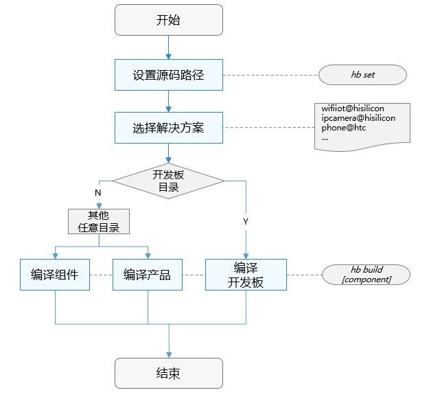
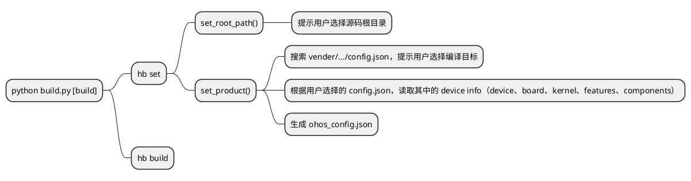

# Harmony 组件的编译、构建

**本章节解析的文件夹及对应源码路径如下：**

| hpm 组件名       | 源码目录   | gitee url                                            |
| ---------------- | ---------- | ---------------------------------------------------- |
| @ohos/build_lite | build/lite | https://openharmony.gitee.com/openharmony/build_lite |

获取源码（本文以 `hpm i @ohos/hispark_pegasus` 为例）后，如果想编译通过，需要走这样几步：

1. 先安装编译器(LLVM、clang)、构建工具（ninja、gn）、python、nodejs 等，并且要选择正确的版本 —— 使用 docker 跳过此步。
2. `cd build/lite; python3 -m pip install --user build/lite` 安装本组件的 cli，即 hb 命令 —— 使用 docker 跳过此步。
3. `hb set` 选择要编译的 target
4. `python3 build.py [build]` 或 `hb build` 编译结果放在 `out/` 目录

我们先从 ninja 说起。

## gn 和 ninja

[ninja](https://ninja-build.org/) （忍者），google chromium 团队出品，致力于比 make 更快的编译系统，可以与其他编译系统配合，如可以使用 Kati 工具把 Makefile 转化成 Ninja files，然后用 ninja 编译；也可以把其他编译系统的输出作为输入，如 CMake + Ninja。

ninja 首次在 2016 年的 Android N 中使用，当前被广泛应用在希望从编译耗时中解脱出来的大型项目中。

gn 意思是 generate ninja，即生成 Ninja 所需的文件（meta data），所以 gn 自称为元数据构建（meta-build）系统，也是 google chromium 团队出品，gn 的文件后缀为 `.gn`、`.gni`。类似 cmake 生成 makefile，gn 会生成 ninja 文件，都是为了减少手工写 make/ninja 文件的工作量。

如果使用 harmony 提供的 docker，gn 和 ninja 都已经安装好了：

```bash
root@90065f887932:/home/openharmony# gn --version
1717 (2f6bc197)
root@90065f887932:/home/openharmony# ninja --version
1.9.0
```

- ninja：[文档](https://ninja-build.org/manual.html)、[Ninja 构建系统 -- ninja 创始人的文章](https://blog.csdn.net/yujiawang/article/details/72627121)
- gn：[github](https://github.com/o-lim/generate-ninja)

gn 的总体流程是：

- 在指定目录查找 `.gn` 文件，如果不存在则向上找直到找到一个，并将其设为 root
- 解析 root 下的 gn 文件以获取 build confing 文件名称，执行 build config 文件（这是一个默认工具链）
- 解析 root 下的 `BUILD.gn` 文件，加载其依赖的其它目录下的 `BUILD.gn` 文件
- 编译出.ninja 文件保存到 `out/`下，如： `./out/arm/obj/ui/web_dialogs/web_dialogs.ninja`;
- 当所有的目标都解决了， 编译出一个根 build.ninja 文件存放在 `out/` 根目录下。

## hb

hb 是 @ohos/build_lite 组件的主要组成部分，python 语言。在 docker 中或 `hpm i` 安装的源码中可以看到其源码：

- docker 中：

```bash
root@90065f887932:/home/openharmony# python3 -c 'import inspect,hb; print(inspect.getfile(hb))'
/root/.local/lib/python3.8/site-packages/hb/__init__.py
root@90065f887932:/home/openharmony# ls /root/.local/lib/python3.8/site-packages/hb
build  clean  common  cts  deps  env  __init__.py  __main__.py  __pycache__  set
```

- 源码中：

```bash
$ ls build/lite/hb
__init__.py __pycache__ clean       cts         env
__main__.py build       common      deps        set
```

hb 将每个子命令的实现放在一个文件夹中：set、build、clean、env……

hb 的构建总体流程：



当执行 `hb set`、`hb build` 的时候进入每个文件夹中执行 `exec_command()` 函数。

### `hb set`

执行 `build/lite/hb/set/set.py` 中的 `exec_command()` 函数:

```python
def exec_command(args):
    return set_root_path() == 0 and set_product() == 0
```

`set_root_path()` 和 `set_product()` 分别解析出 root 路径和产品相关信息，写入 ohos_config.json 文件中。

```python
def set_root_path(root_path=None):
    config = Config()
    if root_path is None:
        root_path = get_input('[OHOS INFO] Input code path: ')
    config.root_path = root_path
    return 0
```

命令行里执行 `hb set` 给出的提示即此上面函数打印。`Config` 是一个单例 class（即：此函数配置的 config 实例值，其他函数都可获取）：

```python
class Config(metaclass=Singleton):
```

Config 单例定义了多个属性：root_path、board、kernel、product、product_path、device_path、out_path……,当做左值的时候会写入 ohos_config.json 文件。

另外一个函数 `set_product()` 即是为了配置 Product，`Product` 是 hb 为产品定义的 class，包含几个静态方法，基本都是解析出配置值，写入 ohos_config.json 文件：

```bash
$ cat common/product.py|grep -B1 'def '
    @staticmethod
    def get_products():
--
    @staticmethod
    def get_device_info(product_json):
--
    @staticmethod
    def get_features(product_json):
--
    @staticmethod
    def get_components(product_json, subsystems):
```

静态方法望文知意:

- `get_products()`: 获取产品信息，递归查找 `vender/` 下包含 config.json 文件的目录，每找到一个即算一个 Product，其中的 config.json 通常包括 vender 预先定义好的发行版配置。

```bash
$ find vendor/ -name config.json
vendor/hisilicon/hispark_aries/config.json
vendor/hisilicon/hispark_pegasus/config.json
vendor/hisilicon/hispark_taurus/config.json
```

上面是 `repo sync` 获取的源码中的 vender 情况，所以在执行 `hb set` 时会提示 3 个选项：

```bash
$ hb set
[OHOS INFO] Input code path: .
OHOS Which product do you need?  (Use arrow keys)

hisilicon
 ❯ ipcamera_hispark_aries
   wifiiot_hispark_pegasus
   ipcamera_hispark_taurus
```

- `get_device_info()`、`get_features()`、`get_components()`: 获取 vender 定义的 config.json 中的各种信息，比如:

```bash
$ cat vendor/hisilicon/hispark_pegasus/config.json | head -n18
{
    "product_name": "wifiiot_hispark_pegasus",
    "ohos_version": "OpenHarmony 1.0",
    "device_company": "hisilicon",
    "board": "hispark_pegasus",
    "kernel_type": "liteos_m",
    "kernel_version": "",
    "subsystems": [
      {
        "subsystem": "applications",
        "components": [
          { "component": "wifi_iot_sample_app", "features":[] }
        ]
      },
      {
        "subsystem": "iot_hardware",
        "components": [
          { "component": "iot_controller", "features":[] }
```

前面 `hb set` 给出的 3 个选项是这里的 product_name。device_info 包括上面的 device、board、kernel；features 和 components 是每个 subsystems 中的信息。

每个 subsystem 对应一个源代码的目录，component 是它依赖的模块，统一放在 ohos_bundles 下面。

### `hb build`

执行 `build/lite/hb/build/build.py` 中的 `exec_command()` 函数，该函数主要处理用户的入参，如：

- `-b`：debug 或 release
- `-c`：指定编译器，默认是 clang
- `-t`：是否编译 test suit
- `-f`：full，编译全部代码
- `-t`：是否编译 ndk，本地开发包，这也是 `@ohos/build_lite` 组件的一部分
- `-T`：单模块编译
- `-v`：verbose

使用这些入参实例化 Build 类：

```python
class Build():
    def __init__(self):
        self.config = Config()
        ......

    def build(self, full_compile, ninja=True, cmd_args=None):
        ......

    def check_in_device(self):
        ......

    def gn_build(self, cmd_args):
        ......

    def ninja_build(self, cmd_args):
        ......

```

实例化后调用 `build.build()`，它会依次调用 `check_in_device()`、`gn_build()` 和 `ninja_build()`。

- `check_in_device()`：读取编译配置，根据产品选择的开发板，读取开发板 config.gni 文件内容，主要包括编译工具链、编译链接命令和选项等。
- `gn_build()`：调用 gn gen 命令，读取产品配置生成产品解决方案 out 目录和 ninja 文件。
- `ninja_build()`：调用 ninja -C out/board/product 启动编译。
- 系统镜像打包：将组件编译产物打包，设置文件属性和权限，制作文件系统镜像。

## python build.py

根目录下的 build.py 通常是 build/lite/build.py 的软连接，执行 `python build.py` 时会运行到 build.py 的 `build()` 函数：

```python
def build(path, args_list):
    cmd = ['python3', 'build/lite/hb/__main__.py', 'build'] + args_list
    return check_output(cmd, cwd=path)
```

可见，仍是执行 `hb build`，入参也可以平移过来，所以可以这么使用：

```bash
python build.py ipcamera_hi3518ev300 -b debug # 全量编译为 debug 版本
python build.py ipcamera_hi3518ev300 -T applications/sample/camera/app:camera_app # 单模块编译
```

所以，build.py 实现了不安装 hb 也能编译的目的。

## hpm

hpm 也是 HW 开发的 build 工具，js 语言，npm 安装：

```bash
$ npm install -g @ohos/hpm-cli
```

在安装路径中可看到其源码：

```bash
root@90065f887932:/home/openharmony# hpm -V
1.2.1
root@90065f887932:/home/openharmony# which hpm
/home/tools/node-v12.20.0-linux-x64/bin/hpm
root@90065f887932:/home/openharmony# ls /home/tools/node-v12.20.0-linux-x64/lib/node_modules/@ohos/hpm-cli
bin                 lib      node_modules  README.md
hpm-debug-build.js  LICENSE  package.json  README_ZH.md
```

## DevEco Device Tool

/home/kevin/.deveco-device-tool/core/deveco-venv/bin/hos run --project-dir /home/kevin/workspace/harmony/src/bearpi --environment bearpi_hm_nano

## 编译流程总结

有多种获取和编译 harmony 源码的方式

| NO. | 编译方式\源码获取方式 | `repo ...` | `hpm i @xxx/xxx` | DevEco New Project | 备注 |
| --- | --------------------- | :--------: | :--------------: | :----------------: | ---- |
| 1.  | `python build.py`     |     Y      |                  |                    |      |
| 2.  | `hb set`, `hb build`  |     Y      |                  |                    |      |
| 3.  | `hpm build/dist`      |            |        Y         |         Y          |      |
| 4.  | DevEco build          |            |                  |         Y          |      |

> 1、2、3 都可以在 harmony 的 docker 中执行



## History

- 2020.12.05: 内核从 liteos_riscv 更名为 liteos_m，build 做适配。

```bash
$ git -P log -n1 897188
commit 8971880bd4f08a2ea01e83dfaadcf7cda7aae858
Author: p00452466 <p00452466@notesmail.huawei.com>
Date:   Sat Dec 5 03:07:19 2020 +0800

    Description:add Change kernel type from liteos_riscv to liteos_m
    Reviewed-by:liubeibei
```

- 20210318: 支持独立的外接设备驱动组件编译

```bash
$ git -P log -n1 814c81
commit 814c816f9b7f900113bed0f75a8122dba5555f65
Merge: 3dc5b1d 5353b23
Author: openharmony_ci <7387629+openharmony_ci@user.noreply.gitee.com>
Date:   Thu Mar 18 19:58:42 2021 +0800

    !44 组件化解耦修改--支持独立的外接设备驱动组件编译
    Merge pull request !44 from kevin/0316_release_build
```

- 2021.03.20: 本模块已经提交到 pypi，[链接](https://pypi.org/project/ohos-build/)

```bash
$ git -P log -n1  958189
commit 95818940a0bc47d25e7454c4d37732e90f7d2df8
Author: pilipala195 <yangguangzhao1@huawei.com>
Date:   Sat Mar 20 12:35:48 2021 +0800

    Upload ohos_build to Pypi
```

- 2021.04.03: 构建不再需要先 `hb set`，可以直接 `hb build`。

```bash
$ git -P log -n1 32d740
commit 32d7402125db0c46c43b05322e588a692f96827a
Author: SimonLi <likailong@huawei.com>
Date:   Sat Apr 3 08:55:13 2021 +0800

    IssueNo: #I3EPRJ
    Description: build device with no need to hb set
    Sig: build
    Feature or Bugfix: Feature
    Binary Source: No
```
