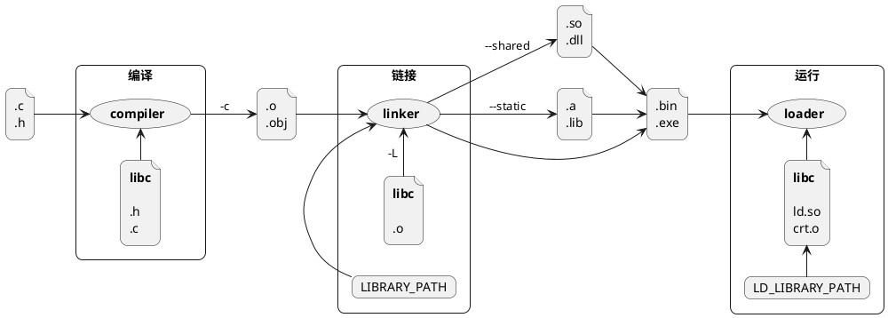
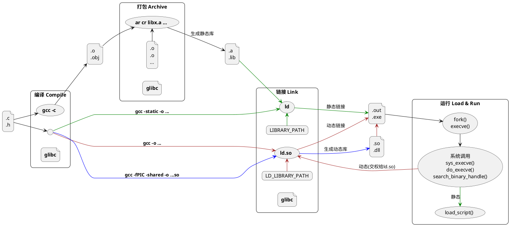

很长一段时间里，我一直以为是这样的：编译、链接、加载运行是 3 个相互独立，串行执行，整个流程如上图。后来发现其中有些错误，并且远不止这么简单，应该是如下图：



比较 2 幅图，其中差异所隐含的知识点是：

- gcc 是前端，cc、as、ar、ld 是后端
- `.a` 静态库与 `.so` 动态库几乎不具可比性
  - `.a` 不是 gcc 或 ld 生成出来的，而是 ar 命令生成出来的，仅仅是一堆 `.o` 的打包，没有重定向操作
  - `.so` 是 `gcc -fPIC -shared` 生成出来的，会去掉入口函数，所以无法直接执行
- 静态链接、动态链接与静态库、动态库的输出、输出关系最容易搞混
  - 静态库是静态链接(`gcc -static`)的输**入**文件，输出是可执行文件
  - 动态库是动态链接(`gcc -shared -fPIC`)的输**出**文件
  - 动态库也是动态链接(`gcc -o ...`)的输**入**文件，输出是可执行文件
- 加载运行（loader）与链接器（linker）密不可分
  - 装载 ELF 文件：bash 或其他启动入口首先调用 `fork()` 创建新进程， 新进程调用 `execve()`，然后进入系统调用： `sys_execve()--do_execve()--search_binary_handle()` 加载、读取、搜索文件的魔数，发现是 `#!` 开头的调用 `load_script()`，发现是 elf 调用 `load_elf_binary()` —— 开始真正意义上的可执行文件加载，包括：判断段有效性、根据 elf header 内存映射、设置程序入口点（静态链接的 elf 设置成 `e_entry` 所对应的值；动态链接的 elf 设置成动态链接器），然后将入口点设置到 EIP 寄存器中，退出系统调用回到用户态，`execve()` 继续从 EIP 寄存器执行，即开始执行新的程序。
  - 所以，运行静态链接的可执行文件比较简单，不需要 ld 再次参与。运行动态链接的可执行文件由系统调用退出后交权给 ld，而不是可执行文件。
- 竟然有 2 个 linker —— OMG！[这里](https://blog.ksub.org/bytes/2016/07/23/ld.so-glibcs-dynanic-linker/loader/)有一篇文章可学习一下。
  - Binutils 项目的 ld : `man ld` 查看手册
  - Glibc 项目的 ld.so：`man ld.so` 查看手册

```bash
$ apt-file search /usr/bin/ld
binutils: /usr/bin/ld
$ ld --help
Usage: ld [options] file...
```

```bash
$ apt-file search /lib/x86_64-linux-gnu/ld-2.23.so
libc6: /lib/x86_64-linux-gnu/ld-2.23.so
$ /lib/x86_64-linux-gnu/ld-2.23.so
Usage: ld.so [OPTION]... EXECUTABLE-FILE [ARGS-FOR-PROGRAM...]
...
```
