# OpenHarmony 简介

## 大小鸿蒙

本文档将 Harmony（鸿蒙）分为 2 个概念：

1. 大鸿蒙：下图中红色 + 蓝色部分，HW 于 2021.06.02 发布的 HarmonyOS2.0 即是此概念
2. 小鸿蒙：下图中红色部分，HW 贡献给 [OpenHarmony（原子社区）](https://gitee.com/openharmony)的代码



鸿蒙开发者相对应也被分为几类：

1. 大鸿蒙 APP 开发：可平滑移植 AOSP 上 Android APP 开发，因为 HW 移植了 AOSP，接口保持了一致，这部分开发使用 DevEco Studio 工具，查看 [HarmonyOS Develope](https://developer.harmonyos.com/cn/home/) 网站文档。与安卓开发不同的是，这部分开发大量使用 js、ts，而不是 JAVA，更类似微信小程序的开发。
   - HarmonyOS 应用开发官网：https://developer.harmonyos.com/cn
   - 华为开发者联盟：[官网](https://developer.huawei.com/cn/)、[HarmonyOS](https://developer.huawei.com/consumer/cn/forum/block/harmonyos)、[weibo](https://m.weibo.cn/p/1005053211647923)
2. 小鸿蒙嵌入式开发：使用 DevEco Device Tool 工具或直接 Docker 中编译，查看 [HarmonyOS Device](https://device.harmonyos.com/cn/home) 和 [HPM](https://hpm.harmonyos.com/#/cn/home) 两个网站，这部分开发模式与传统的嵌入式开发几乎没有区别：搭建环境、编译、烧录版本、JTAG 调试……
   - HarmonyOS 设备开发官网：https://device.harmonyos.com/cn

本文档旨在拆解、分析小鸿蒙的源代码，为嵌入式开发提供学习资料和解决思路。

## 环境、源码、编译

多种方式可实现，对比：

- 源码学习，推荐 1 —— 代码完整，版本已对齐，每个子项目都还是独立的 git 库（有 .git）。
- 自动化编译，推荐 2 —— 全命令行操作，容易合入 CI
- 快速调板，推荐 3 —— 下载源码、toolchain、build 一气呵成，并且包含烧录、分区、调试等功能
- 2、3 都会自动下载 toolchain，并且依赖包保存在 ohos_bundles，但不再是独立的 git 库。

### 1. repo + docker + hb

- 安装 repo

```bash
curl https://gitee.com/oschina/repo/raw/fork_flow/repo-py3 > /usr/local/bin/repo
chmod a+x /usr/local/bin/repo
```

- 拉取代码

```
mkdir HarmonyOS
cd HarmonyOS
repo init -u https://gitee.com/openharmony/manifest.git  -b OpenHarmony_1.0.1_release --no-repo-verify
repo sync -c
```

- docker 最方便的搭建环境

```bash
docker run -it -v $(pwd):/home/openharmony swr.cn-south-1.myhuaweicloud.com/openharmony-docker/openharmony-docker：0.0.4
```

> docker 虽然方便，但包含的 toolchain 并不完整，所含的 hpm、hos、hb、gcc-risc-v 等仅能支持海思的芯片，针对其他品牌的芯片还需自己安装指定的 toolchain。

- build harmonyos

```bash
root@90065f887932:/home/openharmony# hb set
root@90065f887932:/home/openharmony# hb build -f
```

### 2. hpm 方式拉取特定版

- 安装 hpm（或使用上面 docker 中的 hpm）

```bash
npm install -g @ohos/hpm-cli
hpm -V
```

- 找到开发版：在 [HPM 官网](https://hpm.harmonyos.com/#/cn) 上找，或者使用 `hpm search -t distribution` 命令搜索可用的发行版

> 发行版，不是开发板！HPM 发行版对标的是 Linux 发行版概念，指一套软件的集合，但一般与一个开发板对应。
> 以前做嵌入式开发，通常为一个开发板做一套 BSP（板级支持包），但 APP 团队（或部门）拿到 BSP 后做 APP 开发仍会有相当的困难，现在鸿蒙封装出发行版的概念，将 BSP 和 APP 及其 Examples 都打包，极大的降低了二次开发者的门槛。

```bash
$ hpm search -t distribution
┌─────────┬─────────────────────────────────────┬─────────┬─────────────────────────────────────────────────────────────────────┐
│ (index) │                name                 │ version │                             description                             │
├─────────┼─────────────────────────────────────┼─────────┼─────────────────────────────────────────────────────────────────────┤
│    0    │        '@hihope/neptune_iot'        │ '1.0.1' │             '适用于HiHope Neptune WiFi/BT IOT 模组开发'             │
│    1    │   '@bearpi/bearpi_hm_nano_flower'   │ '1.1.0' │            '基于BearPi-HM_Nano开发板实现的护花使者案例'             │
│    2    │ '@bearpi/bearpi_hm_nano_agricul...' │ '1.1.0' │            '基于BearPi-HM_Nano开发板实现的智慧农业案例'             │
│    3    │        '@ohos/hispark_aries'        │ '1.0.3' │          '适用于摄像头类产品开发，具备多媒体及图像功能。'           │
│    4    │       '@ohos/hispark_taurus'        │ '1.0.4' │ '适用于带屏摄像头类产品开发，具备ACE框架，分布式调度能力及多媒体。' │
│    5    │    '@ohos/ip_camera_hi3518ev300'    │ '1.0.3' │          '适用于摄像头类产品开发，具备多媒体及图像功能。'           │
......
```

- 然后执行如下命令下载开发版所需的源码、toolchain、tool 并编译，以 hispark_aries 为例

```bash
mkdir hispark_aries
cd hispark_aries
hpm init dist
hpm i @ohos/hispark_aries
hpm dist # 或 hpm build
```

### 3. DevEco Device Tool 完成一切

- 安装 VSCode、Nodejs、Python
- [安装 DevEco Device Tool](https://device.harmonyos.com/cn/docs/ide/user-guides/install_ubuntu-0000001072959308)
- 在 VSCode 中打开 DevEco 扩展
  - New Project：选择开发版
  - Build：使用的 hos 命令
