# OpenHarmony 简介

## 鸿蒙的蓝海与红海

本文档将 Harmony（鸿蒙）分为 2 个概念：

1. 蓝鸿蒙：下图中蓝色部分，主要用于智能终端，HW 没开源，仅与商业合作伙伴合作，基于 Android 的 AOSP（目前是 Android 11）。
2. 红鸿蒙：下图中红色部分，主要用于 IoT，HW 贡献给 [OpenHarmony（原子社区）](https://gitee.com/openharmony)的代码，于 2021.06.02 发布的 HarmonyOS2.0 即是此概念。



HW 有意混淆两个鸿蒙的概念，对公众不解释物联网、智能终端之间鸿蒙的差异，应该是有些特殊的因素，但这也为鸿蒙品牌带来了风险：HW 高管有些说鸿蒙没有拷贝 Android 一行代码，但未指明是红鸿蒙；又有些高管说鸿蒙基于 AOSP，平滑移植 Android APP，但未指明是蓝鸿蒙 —— 这些宣传会给大众造成一定的困扰。

鸿蒙开发者相对应也被分为 2 类：

1. 蓝鸿蒙 APP 开发（北向开发）：可平滑移植 AOSP 上 Android APP 开发，与 AOSP 接口保持了一致，这部分开发使用 DevEco Studio 工具，查看 [HarmonyOS Develope](https://developer.harmonyos.com/cn/home/) 和 华为开发者联盟（ [官网](https://developer.huawei.com/cn/)、[HarmonyOS](https://developer.huawei.com/consumer/cn/forum/block/harmonyos)、[weibo](https://m.weibo.cn/p/1005053211647923)）网站文档。与安卓开发不同的是，这部分开发除了使用 JAVA 外，还大量使用 js、ts，有点类似微信小程序的开发。
2. 红鸿蒙嵌入式开发（南向开发）：使用 DevEco Device Tool 工具或直接 Docker 中编译，查看 [HarmonyOS Device](https://device.harmonyos.com/cn/home) 和 [HPM](https://hpm.harmonyos.com/#/cn/home) 两个网站，这部分开发模式与传统的嵌入式开发几乎没有区别：搭建环境、编译、烧录版本、JTAG 调试……

**本文档仅拆解、分析开源的红鸿蒙的源码，不涉及蓝鸿蒙部分，拿不到源码，拿到想分析也有心无力，所以北向（APP）开发以后再说。**

## SoC 兼容

| Soc/IP                | Cortex-A       | Cotrex-M          | RISC-V    | 备注              |
| --------------------- | -------------- | ----------------- | --------- | ----------------- |
| 海思                  | Hi3516、Hi3518 |                   | Hi3861    |                   |
| 联盛德(WinnerMicro)   |                |                   | W800      |                   |
| 兆易(GD)/芯来(Nuclei) |                |                   | gd32vf103 | Harmony2.0 新增   |
| Sifive                |                |                   | fe310     |                   |
| 意法                  |                | ~~STM32f103/429~~ |           | Harmony2.0 已去除 |

## 环境、源码、编译

多种方式可实现，对比：

- 源码学习，推荐 1 —— 代码完整，版本已对齐，每个子项目都还是独立的 git 库（有 .git）。
- 自动化编译，推荐 2 —— 全命令行操作，容易合入 CI
- 快速调板，推荐 3 —— 下载源码、toolchain、build 一气呵成，并且包含烧录、分区、调试等功能
- 2、3 都会自动下载 toolchain，并且依赖包保存在 ohos_bundles，但不再是独立的 git 库。

### 1. repo + docker + hb

- 安装 repo

```bash
curl https://gitee.com/oschina/repo/raw/fork_flow/repo-py3 > /usr/local/bin/repo
chmod a+x /usr/local/bin/repo
```

- 拉取代码

```
mkdir HarmonyOS
cd HarmonyOS
repo init -u https://gitee.com/openharmony/manifest.git  -b OpenHarmony_1.0.1_release --no-repo-verify
repo sync -c
```

- docker 最方便的搭建环境

```bash
docker run -it -v $(pwd):/home/openharmony swr.cn-south-1.myhuaweicloud.com/openharmony-docker/openharmony-docker：0.0.4
```

> docker 虽然方便，但包含的 toolchain 并不完整，所含的 hpm、hos、hb、gcc-risc-v 等仅能支持海思的芯片，针对其他品牌的芯片还需自己安装指定的 toolchain。

- build harmonyos

```bash
root@90065f887932:/home/openharmony# hb set
root@90065f887932:/home/openharmony# hb build -f
```

### 2. hpm 方式拉取特定版

- 安装 hpm（或使用上面 docker 中的 hpm）

```bash
npm install -g @ohos/hpm-cli
hpm -V
```

- 找到开发版：在 [HPM 官网](https://hpm.harmonyos.com/#/cn) 上找，或者使用 `hpm search -t distribution` 命令搜索可用的发行版

> 发行版，不是发行板！HPM 发行版对标的是 Linux 发行版概念，指一套软件的集合，但一般与一个开发板对应。  
> 以前做嵌入式开发，通常为一个开发板做一套 BSP（板级支持包），但 APP 团队（或部门）拿到 BSP 后做 APP 开发仍会有相当的困难，现在鸿蒙封装出发行版的概念，将 BSP 和 APP 及其 Examples 都打包，极大的降低了二次开发者的门槛。

```bash
$ hpm search -t distribution
┌---------┬-------------------------------------┬---------┬---------------------------------------------------------------------┐
│ (index) │                name                 │ version │                             description                             │
├---------┼-------------------------------------┼---------┼---------------------------------------------------------------------┤
│    0    │        '@hihope/neptune_iot'        │ '1.0.1' │             '适用于HiHope Neptune WiFi/BT IOT 模组开发'             │
│    1    │   '@bearpi/bearpi_hm_nano_flower'   │ '1.1.0' │            '基于BearPi-HM_Nano开发板实现的护花使者案例'             │
│    2    │ '@bearpi/bearpi_hm_nano_agricul...' │ '1.1.0' │            '基于BearPi-HM_Nano开发板实现的智慧农业案例'             │
│    3    │        '@ohos/hispark_aries'        │ '1.0.3' │          '适用于摄像头类产品开发，具备多媒体及图像功能。'           │
│    4    │       '@ohos/hispark_taurus'        │ '1.0.4' │ '适用于带屏摄像头类产品开发，具备ACE框架，分布式调度能力及多媒体。' │
│    5    │    '@ohos/ip_camera_hi3518ev300'    │ '1.0.3' │          '适用于摄像头类产品开发，具备多媒体及图像功能。'           │
......
```

- 然后执行如下命令下载开发版所需的源码、toolchain、tool 并编译，以 hispark_aries 为例

```bash
mkdir hispark_aries
cd hispark_aries
hpm init dist
hpm i @ohos/hispark_aries
hpm dist # 或 hpm build
```

### 3. DevEco Device Tool 一站式服务

- 安装 VSCode、Nodejs、Python
- [安装 DevEco Device Tool](https://device.harmonyos.com/cn/docs/ide/user-guides/install_ubuntu-0000001072959308)
- 在 VSCode 中打开 DevEco 扩展
  - New Project：选择开发版
  - Build：使用的 hos 命令

## 源码目录

本站即基于此目录展开。

| 目录名       | 描述                                  |
| ------------ | ------------------------------------- |
| build        | 组件化编译、构建和配置脚本            |
| prebuilts    | 编译器及工具链子系统                  |
| kernel       | 内核子系统                            |
| drivers      | 驱动子系统                            |
| test         | 测试子系统                            |
| domains      | 增强软件服务子系统集                  |
| foundation   | 系统基础能力子系统集                  |
| base         | 基础软件服务子系统集&硬件服务子系统集 |
| third_party  | 开源第三方组件                        |
| utils        | 常用的工具集                          |
| vendor       | 厂商提供的软件                        |
| applications | 应用程序样例，包括 camera 等          |
